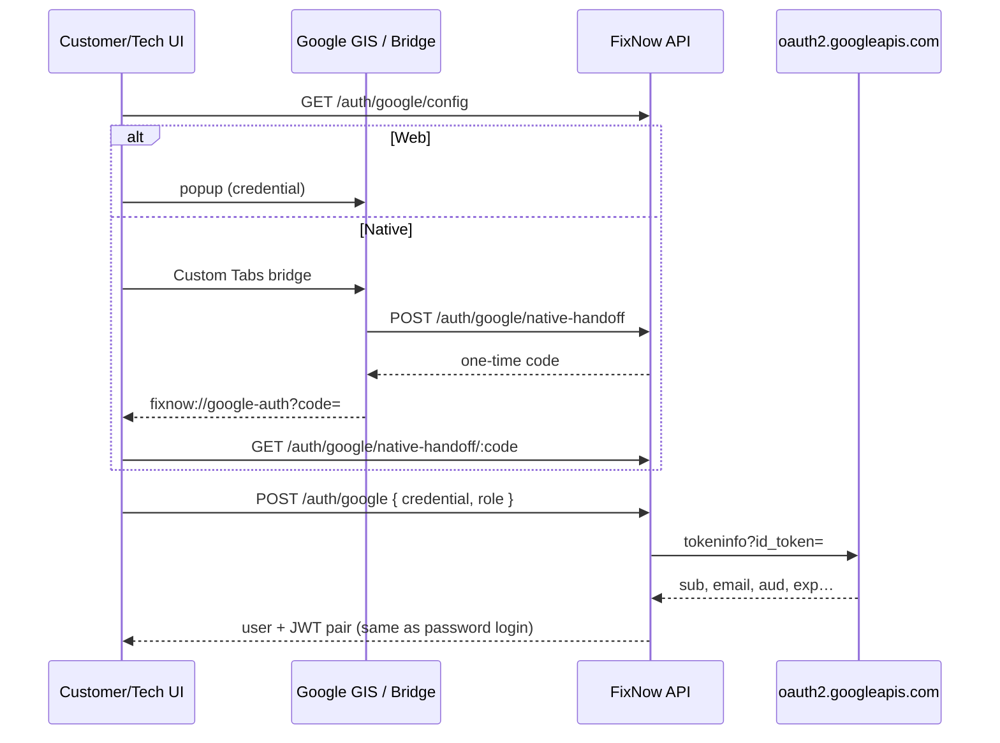

# Google Auth Implementation Report

Google Sign-In is integrated into FixNow’s existing JWT / session / RBAC stack (no parallel auth system). Architecture follows QuikCart’s GIS ID-token + native bridge pattern, adapted to FixNow models and routes. Reference audit: [Audit QuikCart Google auth](597e2fdc-f6a0-4e8a-a3f3-bd854464d5dd).

## Architecture

| Layer | Approach |
| --- | --- |
| Token | Google Identity Services (GIS) **ID token** (`credential`) |
| Web | Branded “Continue with Google” → hidden GIS `renderButton` click → popup |
| Capacitor | GIS blocked in Android WebView (`; wv)`) → hosted bridge in `@capacitor/browser` → one-time handoff code on `fixnow://google-auth` |
| Backend | `tokeninfo` verification → link/create `User` → existing `issueTokenPair` (JWT access + refresh + `Session`) |
| Admin | **No** Google login |



## Backend

### User model (`backend/src/models/auth/User.ts`)

- `googleId` — sparse unique
- `authProviders` — `password` | `google` (merge on link)
- `passwordHash` — optional (Google-only accounts)

### Services

- `backend/src/services/auth/googleAuth.service.ts` — config, `verifyGoogleIdToken`, native handoff issue/consume (2 min TTL, single-use)
- `auth.service.loginWithGoogle` — verify → find by `googleId` or email → role check → link/create profiles → `issueTokenPair`
- Password login rejects Google-only users with a clear message
- `changePassword` allows first password set when `passwordHash` is missing (adds `password` provider)

### Routes

| Method | Path | Notes |
| --- | --- | --- |
| GET | `/api/v1/auth/google/config` | `{ enabled, ready, clientId }` |
| POST | `/api/v1/auth/google` | Login/register with credential + `customer` \| `technician` |
| POST | `/api/v1/auth/google/native-handoff` | Issue handoff code (token verified first) |
| GET | `/api/v1/auth/google/native-handoff/:code` | Consume code → credential |
| GET | `/google-auth-bridge.html` | Hosted GIS bridge for Capacitor |

### Env (`backend/.env.example`)

```env
GOOGLE_AUTH_ENABLED=false
GOOGLE_CLIENT_ID=
PUBLIC_GOOGLE_CLIENT_ID=
```

Verification audience uses `PUBLIC_GOOGLE_CLIENT_ID || GOOGLE_CLIENT_ID`. Client secret is unused (ID-token flow).

### Linking rules

1. Match `googleId`, else email (global unique email — one role per email).
2. Same email, different requested role → 409 conflict.
3. Same `googleId` bound to another email → 409 conflict.
4. Existing password account + Google same email → link `googleId`, merge providers, mark email verified / activate if pending.
5. New user → `ACTIVE`, `emailVerifiedAt` set, customer/technician profile created (photo from Google when present). Technician still completes in-app professional onboarding after Google register.

## Frontend / native

| Piece | Location |
| --- | --- |
| GIS + bridge client | `packages/native/socialAuth.ts` |
| API | `authApi.googleConfig`, `authApi.loginWithGoogle` |
| Session | `AuthProvider.loginWithGoogle` → same `tokenStorage` / refresh cookies |
| Button | `packages/shared/auth/ContinueWithGoogleButton.tsx` |
| UX | Customer + Technician **Login** and **Register** only |
| Bridge HTML | `public/google-auth-bridge.html` + `backend/public/google-auth-bridge.html` |
| Deep link | `fixnow://google-auth` ignored by router (`deepLinks.ts`); consumed by socialAuth |

Button hides itself when config `ready` is false (disabled / missing client ID).

## Operator setup

1. Google Cloud Console → OAuth **Web** client.
2. **Authorized JavaScript origins** must include every place GIS runs:
   - Vite: `http://localhost:5173` (and other local ports)
   - Bridge host: API origin (e.g. `http://localhost:4000`) and production web/API origins
   - Capacitor (if GIS ever runs in-app): `https://localhost`, `https://app.fixnow.local`
3. Set backend: `GOOGLE_AUTH_ENABLED=true`, `GOOGLE_CLIENT_ID` / `PUBLIC_GOOGLE_CLIENT_ID`.
4. Optional frontend: `VITE_GOOGLE_AUTH_BRIDGE_ORIGIN=http://localhost:4000` (defaults to API origin).
5. Custom scheme `fixnow://` is already registered in AndroidManifest for handoff return.
6. Restart API after env changes. Confirm `GET /api/v1/auth/google/config` returns `ready: true`.

## Testing (without live Google credentials)

| Check | Result |
| --- | --- |
| Backend `tsc --noEmit` | Pass |
| Config with `GOOGLE_AUTH_ENABLED=false` | Button hidden; endpoints return 503 when called |
| Admin login pages | Unchanged (no Google button) |
| Live Google popup / Custom Tabs | Requires real OAuth client + origins (operator step above) |

### Manual test plan (with credentials)

- [ ] Customer register via Google → lands authenticated on home; user has `authProviders: ['google']`
- [ ] Customer login via Google (existing) → JWT session restores after reload
- [ ] Password account + Google same email → linked; both methods work
- [ ] Technician Google register → skips OTP, continues professional steps
- [ ] Technician Google login → dashboard
- [ ] Role mismatch (customer email on technician Google) → clear conflict message
- [ ] Cancel popup / dismiss Custom Tabs → calm cancel message
- [ ] Offline / bad network → friendly network error
- [ ] Admin remains password-only

## Security notes

- Identity comes only from verified tokeninfo payload (iss, aud, exp, email_verified, email, sub).
- Handoff codes are random, short-lived, single-use; credential re-verified before issue.
- No Google client secret in the browser; no parallel opaque QuikCart session store — FixNow JWTs unchanged.
- Rate limits: login limiter on `/auth/google`; auth limiter on config/handoff.

## Out of scope

- Admin Google Sign-In
- Sign in with Apple
- Firebase Auth / Passport OAuth redirect callbacks
- Redesign of existing auth screens beyond adding the Google control
