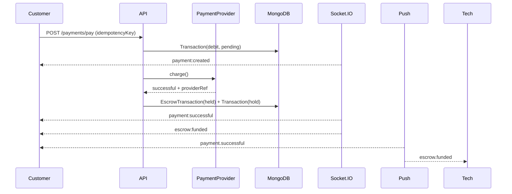
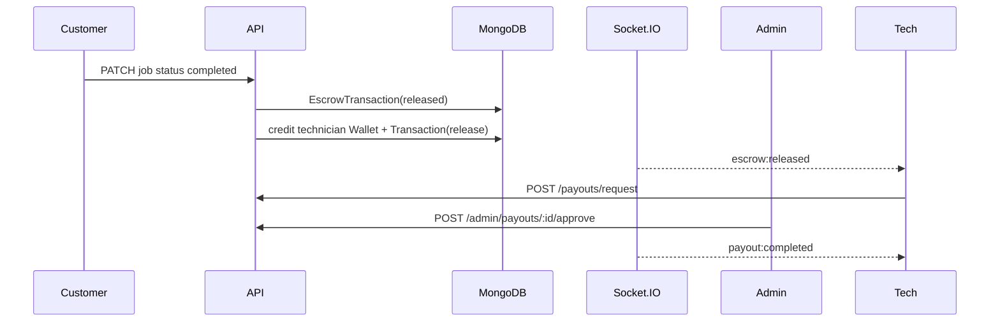
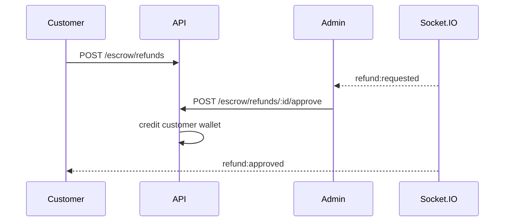

# Payments & Escrow Architecture

## Overview

FixNow payments use the existing MongoDB collections only:

- `Wallet` — per-user balance (`availableBalance`, `heldBalance`)
- `Transaction` — ledger of debit / hold / release / refund / payout / fee / credit
- `EscrowTransaction` — job-scoped escrow lifecycle
- `MobileMoneyAccount` — saved MTN / Airtel numbers

There is no separate Payment / Payout / Refund collection. Payment intents are `Transaction` rows with `type: debit`. Payouts are `type: payout`. Refunds are `type: refund`.

## Payment flow

```
Customer pays for assigned job
  → Transaction(debit, pending/processing)
  → Provider charge (MTN | Airtel | Flutterwave | Pesapal | Stripe | console)
  → On success:
       EscrowTransaction(held)
       Transaction(hold, completed)
       emit payment:successful + escrow:funded
       push notifications
  → Technician completes work → customer confirms (job completed)
  → Escrow release:
       credit technician Wallet.availableBalance
       Transaction(release, completed)
       EscrowTransaction(released)
       emit escrow:released
```

Idempotency: `idempotencyKey` (or derived key) is hashed into unique `Transaction.reference`. Duplicate pay requests return the existing transaction.

## Escrow lifecycle

| Status | Meaning |
|--------|---------|
| `held` | Customer paid; funds locked pending completion |
| `disputed` | Party opened a dispute; admin must intervene |
| `partially_released` | Partial refund processed; remainder may still release |
| `released` | Funds credited to technician wallet |
| `refunded` | Fully refunded to customer wallet |

Support:

- Full / partial refunds (`POST /escrow/refunds` → admin approve)
- Disputes (`POST /escrow/disputes`)
- Admin resolve (`POST /escrow/disputes/resolve` with `release` | `refund`)
- Optional auto-release when `ESCROW_AUTO_RELEASE_MS > 0` and job is `completed`

## Provider abstraction

```
backend/src/providers/payments/
  types.ts              — PaymentProvider interface
  console.provider.ts   — simulated HMAC-ready adapter
  mtn.provider.ts       — MTN MoMo placeholder
  airtel.provider.ts    — Airtel Money placeholder
  flutterwave.provider.ts
  pesapal.provider.ts
  stripe.provider.ts    — Stripe placeholder
  index.ts              — getPaymentProvider(id)
```

Providers: `console`, `mtn`, `airtel`, `flutterwave`, `pesapal`, `stripe`.

When `PAYMENTS_LIVE=false` (default), all providers simulate successful charges so local and E2E flows complete without external credentials. Live adapters plug into the same interface without changing services or models.

## Sequence diagrams

### Pay → escrow fund



### Complete → release → payout



### Refund request → admin approve



## Wallet model

- Created on first payment / earnings access
- Debit payments from external providers do **not** reduce customer available balance (external MoMo charge)
- Optional `useWallet: true` pays from customer `availableBalance`
- Escrow release credits technician `availableBalance`
- Payout request debits technician available balance and creates pending `payout` transaction

## Security

- Webhook verification via HMAC (`PAYMENT_WEBHOOK_SECRET`, header `x-fixnow-signature`)
- Audit logs for payment create/success/fail, escrow release, refund, payout
- Unique `reference` prevents duplicate processing
- Role checks on all payment / escrow / payout endpoints
- Job completion still succeeds even if escrow release side-effect fails (logged, retryable)

## Webhooks

`POST /api/v1/webhooks/payments/:provider`

Body example:

```json
{
  "event": "charge.successful",
  "reference": "pay_...",
  "providerRef": "mtn_..."
}
```

## Realtime events

| Event | When |
|-------|------|
| `payment:created` | Pay initiated |
| `payment:successful` | Charge completed + escrow funded |
| `payment:failed` | Charge failed |
| `escrow:funded` | Escrow held |
| `escrow:released` | Funds to technician |
| `refund:requested` | Refund pending approval |
| `refund:approved` | Refund credited |
| `payout:completed` | Admin-approved payout sent |

## Push notifications

Uses existing `notifyUser` / preference pipeline for:

- payment successful / failed
- escrow funded / released
- refund processed
- payout completed

## API endpoints

### Customer / shared

- `GET /payments/providers`
- `GET /payments/wallet`
- `GET /payments/transactions`
- `GET /payments/transactions/:id`
- `GET /payments/transactions/:id/receipt`
- `POST /payments/pay` (customer)
- `GET|POST /payments/methods` · `DELETE /payments/methods/:id`
- `GET /escrow` · `GET /escrow/jobs/:id`
- `POST /escrow/refunds` · `POST /escrow/disputes`

### Technician

- `GET /payouts/earnings`
- `POST /payouts/request`

### Admin

- `GET /admin/payments/dashboard` · `GET /admin/payments` (supports `status`, `q` search)
- `GET /admin/refunds/pending` · `POST /escrow/refunds/:id/approve`
- `GET /admin/escrow/dashboard`
- `GET /admin/settlements`
- `GET /admin/payouts/pending` · `POST /admin/payouts/:id/approve`
- `POST /escrow/disputes/resolve`
- `POST /escrow/jobs/:id/release`

## Frontend (Stitch-aligned)

- Customer: `/customer/payments`, pay job, success, receipt (Stitch payment methods / select / success)
- Technician: `/technician/earnings` (Stitch earnings_payouts)
- Admin: `/admin/payments` (Stitch financial overview + escrow dispute)

## Env

```
PAYMENT_DEFAULT_PROVIDER=console
PAYMENTS_LIVE=false
PAYMENT_WEBHOOK_SECRET=
ESCROW_AUTO_RELEASE_MS=0
```
