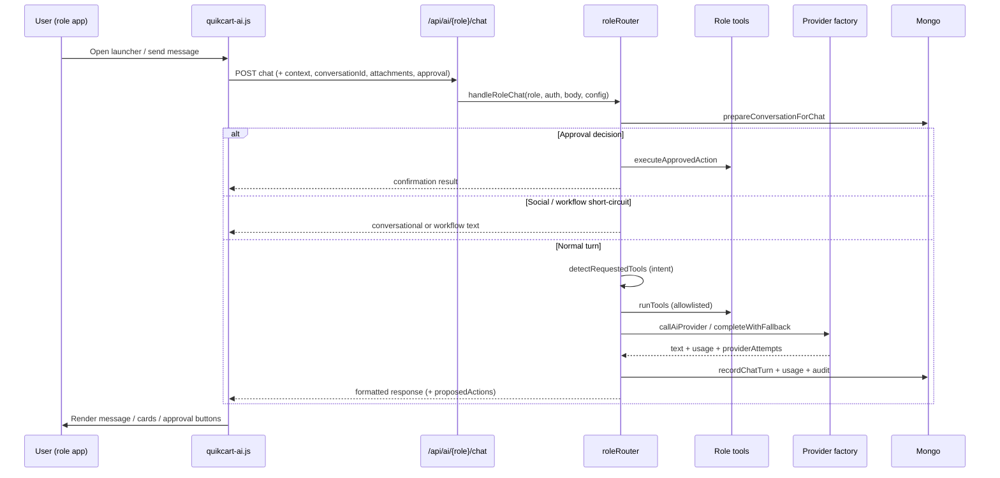

# QuikCart AI Implementation Analysis

**Source (read-only):** `D:\QQCART\QuikCart APP VND cursor`  
**Scope:** Architecture, backend AI services, providers, prompts, APIs, role separation, frontend UX, memory, safety, streaming, tools, configuration  
**Purpose:** Document how QuikCart AI was built and extract reusable patterns (e.g. for FixNow)  
**Constraint:** QuikCart was not modified. FixNow application code was not changed beyond this analysis file.

---

## 1. Executive summary

QuikCart AI is a **central, role-aware marketplace copilot** layered on top of an existing Express + MongoDB + vanilla-JS multi-app platform. It is not a generic chatbot bolted onto the UI. It is a **tool-orchestrated assistant** with:

1. **Server-resolved roles** (never trust browser-claimed role).
2. **Allowlisted tools per role** with preview → human approval → execute.
3. **Provider-agnostic LLM adapters** (OpenAI, Gemini, Anthropic, Groq, Mistral, local) via HTTP — no vendor SDKs in `package.json`.
4. **Deterministic intent routing** (regex + role intent modules) rather than native LLM function-calling.
5. **Graceful degradation** when AI is disabled or providers fail (simple conversational fallback + tool-backed deterministic answers).
6. **One shared frontend shell** (`Frontend-shared/ai/`) mounted into customer, vendor, shopper, and admin apps.

**How it was built (in practice):** start from an isolated `services/ai/` module + role chat endpoints; expand into recommendations, workflows, approvals, conversations, speech, documents, admin settings, and UX analytics — with a large Node test suite guarding regressions.

---

## 2. High-level architecture

```text
┌──────────────────────────────────────────────────────────────────────┐
│  Role frontends (vanilla HTML/CSS/JS)                                │
│  Customer | Vendor | Shopper | Admin                                 │
│                                                                      │
│  Frontend-shared/ai/                                                 │
│   quikcart-ai-loader.js → aiDisplayValue.js → quikcart-ai.js + CSS   │
│   Floating launcher → fullscreen chat panel → suggestions/approvals  │
└───────────────────────────────┬──────────────────────────────────────┘
                                │ REST /api/ai/*
                                ▼
┌──────────────────────────────────────────────────────────────────────┐
│  Express: createAiRouter (src/routes/aiRoutes.js)                    │
│  Auth deps injected from Backend-Server/index.js                     │
│  Rate-limited /api/ai mount                                          │
└───────────────────────────────┬──────────────────────────────────────┘
                                │
                                ▼
┌──────────────────────────────────────────────────────────────────────┐
│  roleRouter.handleRoleChat                                           │
│   1. Multimodal normalize + attachment validation                    │
│   2. Conversation prepare / history                                  │
│   3. Approval short-circuit (approve/reject mutation)                │
│   4. Social short-circuit (greetings / thanks)                       │
│   5. Role workflow handlers (customer/vendor/shopper/admin)          │
│   6. Intent → allowlisted tools → agent.runTool                      │
│   7. Attach approval proposals for preview-only mutations            │
│   8. LLM completeWithFallback OR simple/deterministic fallback       │
│   9. Format + sanitize + audit + usage + persist turn                │
└───┬──────────────┬──────────────┬──────────────┬─────────────────────┘
    │              │              │              │
    ▼              ▼              ▼              ▼
 Agents        Tools         Providers      Stores
 (prompts)   (role-scoped)  (HTTP adapters) Mongo: conversations,
                                            approvals, usage, settings
```

### Design principles observed

| Principle | Implementation |
|-----------|----------------|
| Isolation | All AI under `Backend-Server/src/services/ai/`; feature-flag kill switches |
| Role trust boundary | Auth from session/token; `permissionPolicy` + tool allowlists |
| No silent writes | `AI_ACTION_APPROVAL_REQUIRED`; preview tools + `AiApproval` |
| No frontend secrets | Keys only on server; public status strips `keySource` / `keyEnv` |
| Environment awareness | Production forbids seed/demo leakage via `aiModeRetrievalGuard` + prompt rules |
| Fail soft | Disabled/unavailable → `simpleFallbackChat` / managed recommendation fallback |

---

## 3. End-to-end chat flow



### Request shape (conceptual)

```json
{
  "message": "lunch under 20000",
  "conversationId": "...",
  "context": {
    "screen": "marketplace",
    "selectedArea": "kampala-central",
    "customerLocation": { "lat": 0, "lng": 0 },
    "pendingCartChange": null
  },
  "selectedSuggestion": { "id": "...", "prompt": "..." },
  "attachments": [],
  "actionApproval": { "approvalId": "...", "approved": true }
}
```

### Response shape (conceptual)

```json
{
  "ok": true,
  "message": "...",
  "provider": "gemini",
  "conversationId": "...",
  "recommendations": [],
  "proposedActions": [{
    "requiresApproval": true,
    "approvalId": "...",
    "approvalButton": "Add to Cart"
  }],
  "workflowProgress": null,
  "suggestedUiAction": null,
  "disabled": false
}
```

**Streaming:** not implemented. Provider adapters declare `streaming: false`. Chat is request/response JSON only.

---

## 4. Folder structure

### Backend AI module

```text
Backend-Server/src/services/ai/
├── config/
│   ├── aiConfig.js                 # Env + DB settings → runtime config
│   ├── aiSettingsStore.js          # Persisted admin AI settings
│   └── aiModeRetrievalGuard.js     # Prod/staging data exposure guard
├── core/
│   ├── roleRouter.js               # Main orchestration entry
│   ├── permissionPolicy.js         # Role enablement, tool allowlists, cross-role guards
│   ├── contextBuilder.js           # Safe role context for prompts
│   ├── providerClient.js           # Thin wrapper → providerFactory
│   ├── detectQuikCartIntent.js     # Intent → tools
│   ├── conversationalCore.js       # Greetings / social turns
│   ├── simpleFallbackChat.js       # Offline/disabled conversational fallback
│   ├── responseFormatter.js        # Public response contract
│   ├── responseSanitizer.js / responseDedup.js
│   ├── executeApprovedAction.js    # Mutation after approval
│   ├── confirmationRouting.js
│   ├── auditLogger.js / usageTracker.js
│   ├── smartRecommendationContract.js
│   └── roleCapabilityMatrix.js
├── prompts/
│   ├── customerPrompt.js / vendorPrompt.js / shopperPrompt.js / adminPrompt.js
│   └── *SupportPrompt.js           # Support-automation variants
├── roles/
│   ├── customerAgent.js / vendorAgent.js / shopperAgent.js / adminAgent.js
│   └── *SupportAgent.js            # Prompt + runTool binding only
├── tools/
│   ├── customerTools.js / vendorTools.js / shopperTools.js / adminTools.js
│   ├── sharedSanitizers.js
│   ├── ToolRegistry.js / ToolExecutor.js / toolRegistryMetadata.js
│   └── toolRegistryConstants.js
├── providers/
│   ├── providerRegistry.js         # Provider definitions + aliases
│   ├── providerFactory.js          # Fallback chain + retries
│   ├── baseProvider.js / openAiCompatibleProvider.js
│   ├── openaiProvider.js / geminiProvider.js / anthropicProvider.js
│   ├── groqProvider.js / mistralProvider.js / localProvider.js
│   └── providerRequestPolicy.js
├── conversations/
│   ├── conversationService.js
│   └── conversationSecurity.js
├── approvals/
│   ├── approvalStore.js            # Facade
│   ├── approvalMemoryStore.js
│   └── approvalMongoStore.js
├── workflows/
│   ├── WorkflowStateMachine.js / WorkflowSession.js / WorkflowManager.js
│   ├── customerWorkflowService.js / vendorWorkflowService.js
│   ├── shopperWorkflowService.js / adminWorkflowService.js
│   └── templates/                  # Per-role multi-step copilots
├── recommendations/                # Smart product/basket recommendations
├── shoppingCopilot/                # Catalog search + cart change planner
├── suggestions/                    # Chip catalog + delivery resolution
├── speech/                         # STT provider registry + upload
├── documents/                      # Upload + understanding providers
├── multimodal/                     # Normalize voice/image/doc inputs
├── behavior/                       # Optional customer behavior profiles
├── analytics/                      # UX event tracker
├── location/                       # Location context for copilots
└── types/aiTypes.js                # Roles, TOOL_DEFINITIONS, destructive patterns
```

### Routes & models

```text
Backend-Server/src/routes/aiRoutes.js
Backend-Server/src/models/mongooseModels.js
  → AiConversation, AiMessage, AiApproval, AiApprovalAudit, AiUsageLog
  (+ AI settings persistence via aiSettingsStore)
```

### Frontend

```text
Frontend-shared/ai/
├── quikcart-ai-loader.js   # Safe async bootstrap after core-ready
├── quikcart-ai.js          # Full UI + API client (~4.5k+ lines)
├── quikcart-ai.css
└── aiDisplayValue.js       # XSS-safe display helpers

Mounted from:
  Frontend-customer/customer.html
  Frontend-Vendor/...
  Frontend-Shopper/...
  Frontend- admin/...
```

### Planning / audit docs (already in QuikCart)

Useful historical design notes (not code):

- `QuikCart-AI-Assistant-Implementation-Plan.md`
- `docs/QUIKCART_AI_ROLE_CAPABILITY_MATRIX.md`
- Multiple `QUIKCART_AI_*` audit/report markdown files at repo root

---

## 5. API surface

Mounted at `/api/ai` (rate-limited in `index.js`).

| Method | Path | Purpose |
|--------|------|---------|
| GET | `/status` | Public AI feature flags / launcher settings (no secrets) |
| GET | `/suggestions` | Context-aware suggestion chips by platform role |
| GET | `/diagnostics` | Dev-only diagnostics (404 in prod/staging) |
| GET/PATCH | `/admin/settings` | Admin AI configuration UI backend |
| GET | `/admin/usage` | Budget / usage summary |
| GET | `/admin/ux-analytics` | Aggregated UX events |
| POST | `/ux-events` | Client UX telemetry |
| GET/POST | `/document-uploads*` | Ephemeral uploads + analyze/ask |
| POST | `/speech/transcribe` | Server STT (when not browser-only) |
| GET/POST/DELETE | `/conversations*` | Conversation CRUD + messages |
| POST | `/customer/chat` | Customer/guest chat |
| POST | `/vendor/chat` | Vendor chat (auth required) |
| POST | `/shopper/chat` | Shopper chat (auth required) |
| POST | `/admin/chat` | Admin chat (auth required) |

Auth pattern:

- **Customer:** optional bearer / `x-quikcart-customer-token` → guest if absent.
- **Vendor / Shopper / Admin:** required role session resolvers injected as router deps.
- **Conversations:** stricter ownership (`conversationSecurity`); guests keyed by session/cart headers.

---

## 6. Role separation

### Roles

| AI role | Platform users | Auth | Typical job |
|---------|----------------|------|-------------|
| `customer` | Signed-in shoppers | Optional | Discover, recommend, cart preview, order status |
| guest (frontend) | Anonymous | Session headers | Same customer endpoint, limited personalization |
| `vendor` | Merchants | Required | Inventory, drafts, shop setup, promos |
| `shopper` | Delivery/pickup agents | Required | Assigned orders, stations, priorities |
| `admin` | Ops / finance / support admins | Required + permissions | Marketplace health, costs, create previews |
| `*_support` | Support automation mode | Feature-flagged | Narrower tool sets + support prompts |

Frontend maps `document.body.dataset.quikcartRole` → launcher copy + chat endpoint.

### Capability tiers (enforced in code)

From QuikCart’s own matrix (`docs/QUIKCART_AI_ROLE_CAPABILITY_MATRIX.md` + `aiTypes.js`):

| Tier | Behavior |
|------|----------|
| read-only | Allowlisted query tools |
| draft-prepare | Preview/draft only |
| confirmation-required | Mutate only after approval |
| forbidden | No tool / cross-role / destructive pattern block |

**Hard forbidden examples:** AI does not checkout/pay, grant permissions, auto-refund, auto-assign shoppers, or publish without confirmation.

### Cross-role safety

`permissionPolicy.crossRoleIntent` returns a fixed refusal string when a user asks for another role’s data (e.g. customer asking for admin analytics). Tools are also filtered through `TOOL_DEFINITIONS[role]`.

---

## 7. Providers

### Registry

Defined in `providers/providerRegistry.js`:

| Provider | Default model (code) | Key env vars | Transport |
|----------|----------------------|--------------|-----------|
| `none` | — | — | Disabled |
| `openai` | `gpt-4o-mini` | `OPENAI_API_KEY`, `AI_API_KEY` | OpenAI-compatible chat HTTP |
| `gemini` | `gemini-3-flash-preview` | `GEMINI_API_KEY`, `GOOGLE_AI_API_KEY` | Gemini adapter |
| `anthropic` | `claude-3-5-sonnet-latest` | `ANTHROPIC_API_KEY` | Anthropic adapter |
| `groq` | `llama-3.1-70b-versatile` | `GROQ_API_KEY` | OpenAI-compatible |
| `mistral` | `mistral-large-latest` | `MISTRAL_API_KEY` | OpenAI-compatible |
| `local` | `local-model` | optional `LOCAL_MODEL_API_KEY` + base URL | OpenAI-compatible (Ollama/LM Studio style) |

### Selection & fallback

`aiConfig.resolvePrimaryProvider`:

1. Explicit argument / manual DB selection
2. Else `AI_PROVIDER` env (wins over non-manual DB)
3. Else auto-select if exactly one credentialed provider
4. Else `none`

`providerFactory.completeWithFallback`:

- Builds chain: primary + `AI_PROVIDER_FALLBACK` + `AI_PROVIDER_FALLBACK_CHAIN`
- Per-provider retries/timeouts
- Skips providers that lack required capabilities (e.g. image input)
- Returns attempt diagnostics for admin tooling

**Important:** QuikCart does **not** depend on `openai` / `@google/generative-ai` / `@anthropic-ai/sdk` npm packages. Adapters use raw HTTP (`requestJson` in `baseProvider`).

### Speech providers (separate)

`speech/speechProviderRegistry.js`: browser Web Speech, OpenAI Whisper, Google Speech, AssemblyAI, disabled. Configured via `AI_SPEECH_*` env vars.

### Document providers (separate)

Local text extraction + AI-text analysis providers; uploads gated per role.

---

## 8. Prompt design

### Structure

Each role exports a **static system prompt string** plus a shared hardening trailer:

```text
You are QuikCart {Role} Assistant.
Use Safe role context...
Help with {role-specific capabilities}...
Never reveal {cross-role secrets}...
Ground answers in tool results...
Require confirmation before changes...
Plain text only (no markdown)...
{PROMPT_HARDENING}
```

Additional dynamic prompt layers in `roleRouter`:

- Environment system prompt (prod vs staging vs dev rules)
- Shared conversational style block (`conversationalCore.sharedConversationPromptBlock`)
- Language preference instruction
- Safe role context JSON from `contextBuilder`
- Conversation history (when enabled)
- Tool results + multimodal attachment summaries

### Prompt strengths

- Explicit anti-hallucination: “do not invent shops/products/status”
- Explicit anti-leak: no tool names, IDs, API keys, seed credentials in user replies
- Role voice: shopping teammate / ops teammate / delivery coordinator / operations manager
- Plain-text UX policy (mobile-friendly chat bubbles)
- Separation of support prompts vs primary copilots

### Prompt weaknesses

- Large static prompts + large tool-result payloads can be token-heavy
- Intent is mostly regex, so prompts cannot recover well when tool selection is wrong
- “Never say data unavailable” style hardening (vendor prompt) can push soft hallucination if tools fail and fallbacks are weak

---

## 9. Tools & “agent” model

Agents are thin:

```js
// roles/customerAgent.js
module.exports = {
  role: "customer",
  systemPrompt,
  runTool: runCustomerTool
};
```

**Tool selection is not native LLM tool-calling.** Flow:

1. `detectRequestedTools` / `detectQuikCartIntent` / `roleAgentIntent`
2. Regex / suggestion / page-context heuristics
3. `agent.runTool(name, args, context)` sequentially
4. Results fed into the LLM as grounded context

This is effectively a **plan-then-call** architecture with server-side planning.

### Tool categories (examples)

| Role | Read | Draft | Confirm |
|------|------|-------|---------|
| Customer | search products/shops, cart, orders, stations | prepare cart change | addRecommendedItemsToCart |
| Vendor | orders, inventory, visibility | product/description/shop drafts | stock update / shop submit |
| Shopper | assigned orders, station timing | — | (status updates via normal UI; AI mostly advisory) |
| Admin | health, costs, risks, visibility | prepare create station/area/unit/category | confirmAdminAction |

`ToolRegistry` classifies tools (read / draft / write) for metadata and workflow gating.

---

## 10. Conversation memory & context

### Persistence

Mongo models:

- `AiConversation` — ownerUserId, platformRole, assistantType, title, status
- `AiMessage` — conversationId, sender, content, metadata (sanitized assistant payload)

Features:

- History enabled by `AI_CONVERSATION_HISTORY_ENABLED`
- Retention limits + soft delete
- Guest ownership via `x-quikcart-session-id` / cart token
- Signed-in customers blocked from guest conversation namespace
- Provider history is a sanitized recent-turn window (`historyForProvider`)

### Request context (ephemeral)

Frontend sends workspace hints: screen, selected area, shop/station/order IDs, cart summary, pending approvals, workflow progress. `contextBuilder` strips internal IDs and builds **safe role context** for the model.

### Personalization

Optional customer behavior profiles (`behavior/behaviorProfileService`) enrich customer context when enabled — still sanitized and scoped.

### Approvals as short-term memory

`AiApproval` stores proposed mutations with TTL; frontend sends `actionApproval` to execute/cancel. This is operational memory distinct from chat transcript memory.

---

## 11. Workflows (multi-step copilots)

Beyond single-turn Q&A, QuikCart added **workflow state machines**:

- Customer: choose station, build cart from text, track order, cheapest item, delivery ETA
- Vendor: create shop submission
- Shopper: accept/brief/navigate/item found/unavailable/status/delay/handoff
- Admin: ops/finance/support/super-admin templates (permission gated)

`roleRouter` short-circuits into workflow handlers before generic tool+LLM turns when a workflow claims the message. Frontend renders `workflowProgress` and `suggestedUiAction` bridges into role-specific `QuikCart*Actions` objects.

---

## 12. Frontend UX & navigation

### Bootstrap

1. Role HTML includes `quikcart-ai.css` + `quikcart-ai-loader.js`
2. Loader waits for `quikcart:core-ready` (with timeout)
3. Loads `aiDisplayValue.js` then `quikcart-ai.js`
4. On init failure → removes AI root; app continues without assistant

### Interaction model

- Floating **launcher** (pill/circular; position configurable via admin settings)
- Opens **fullscreen chat panel** (especially mobile ≤640px)
- Opening headline + subhead + intro copy per role
- Suggestion chips from `/api/ai/suggestions` (context-aware)
- Composer with attachments: image, camera, location, shopping list, documents (role-dependent)
- Voice capture when enabled (browser STT or server transcribe)
- Conversation history sidebar (server-backed when authenticated/sessioned)
- Approval cards for proposed cart/stock/admin actions
- UI action bridges: open shop form, select station, open admin module, etc.

### Navigation philosophy

AI does **not** replace app navigation. It:

1. Explains and recommends
2. Optionally deep-links / suggests UI actions
3. Requires confirmation for mutations
4. Defers checkout, payment, and destructive ops to existing screens

### UX analytics

Client posts events: `launcher_open`, `chat_start`, `suggestion_click`, `approval_accept`, `approval_reject`, `ai_cart_add`.

---

## 13. Safety & governance

| Control | Where |
|---------|--------|
| Role enable flags | `AI_*_ASSISTANT_ENABLED` + DB settings |
| Master kill switch | `AI_ASSISTANT_ENABLED` |
| Tool allowlists | `TOOL_DEFINITIONS` |
| Cross-role refusals | `crossRoleIntent` |
| Destructive lexicon | `DESTRUCTIVE_ACTION_PATTERNS` |
| Human approval | `AI_ACTION_APPROVAL_REQUIRED` + approval stores |
| Budget hard stop | `AI_MONTHLY_BUDGET_USD` + usage tracker |
| Audit logging | `AI_AUDIT_LOGGING_ENABLED` |
| Prod data guard | `aiModeRetrievalGuard` + environment prompts |
| Response sanitization | `responseSanitizer` / formatter |
| Admin permission checks | `adminCan` / workflow access modules |
| Attachment ownership | Document upload auth + ephemeral validation |

---

## 14. Configuration / environment variables

Primary knobs (from `Backend-Server/.env.example`):

```env
AI_PROVIDER=none
AI_PROVIDER_FALLBACK=
AI_PROVIDER_FALLBACK_CHAIN=
AI_API_KEY=
OPENAI_API_KEY=
GEMINI_API_KEY=
ANTHROPIC_API_KEY=
GROQ_API_KEY=
AI_MODEL=
AI_MODEL_CUSTOMER= / AI_MODEL_VENDOR= / AI_MODEL_SHOPPER= / AI_MODEL_ADMIN=
AI_ASSISTANT_ENABLED=false
AI_CUSTOMER_ASSISTANT_ENABLED=false
AI_VENDOR_ASSISTANT_ENABLED=false
AI_SHOPPER_ASSISTANT_ENABLED=false
AI_ADMIN_ASSISTANT_ENABLED=false
AI_RECOMMENDATION_ENABLED=false
AI_SUPPORT_AUTOMATION_ENABLED=false
AI_VOICE_COMMANDS_ENABLED=false
AI_MULTIMODAL_ENABLED=false
AI_CONVERSATION_HISTORY_ENABLED=true
AI_DOCUMENT_UPLOADS_ENABLED=false
AI_ACTION_APPROVAL_REQUIRED=true
AI_TRACK_USAGE=true
AI_MONTHLY_BUDGET_USD=50
AI_AUDIT_LOGGING_ENABLED=true
# plus speech/document/vision/timeout/retry variants
```

Admin can also override many settings via `/api/ai/admin/settings` (DB-backed), including launcher appearance and suggestion copy — with careful precedence rules so env provider selection is not silently overridden unless manually selected.

---

## 15. Dependencies

### Backend `package.json` (AI-relevant reality)

Runtime stack used by AI:

- `express` — routes
- `mongoose` / `mongodb` — conversations, approvals, usage
- `multer` — speech/document uploads
- `dotenv` — env
- (platform) `redis`, `cloudinary`, `firebase-admin`, `@sentry/node` — surrounding infra, not AI core

**No dedicated LLM SDK dependencies.** Providers are hand-rolled HTTP adapters.

### Frontend

No npm AI SDK. Shared vanilla JS + CSS only. Role apps load scripts statically / via loader.

### Tests

Heavy coverage via Node’s built-in test runner, e.g.:

- `aiAssistant.test.js`
- `conversationHistory.test.js` / `conversationSecurity.test.js`
- smart recommendation + shopping copilot suites
- speech / document / workflow / mode-separation suites
- Playwright e2e for fullscreen AI transitions

---

## 16. Strengths

1. **True role isolation** with server auth + tool allowlists + cross-role refusals.
2. **Human-in-the-loop mutations** — AI proposes; user confirms; existing business services execute.
3. **Provider portability** with fallback chains and role-specific models.
4. **Production-minded guards** — seed leakage, budget stops, audit logs, diagnostics locked in prod.
5. **Shared frontend module** keeps four apps consistent without React/Vue rewrite.
6. **Graceful degradation** when AI is off — app remains usable; chat still answers basic social/local fallbacks.
7. **Workflow copilots** go beyond Q&A into guided multi-step ops.
8. **Grounding culture** — prompts and formatters push tool-backed answers.
9. **Extensive tests and internal audit docs** show iterative hardening.
10. **Admin observability** — usage, provider readiness, UX analytics, settings UI.

---

## 17. Weaknesses / risks

1. **Monolithic frontend AI file** (`quikcart-ai.js`) is large and hard to maintain.
2. **No streaming** — perceived latency for long LLM turns.
3. **Regex intent routing** is brittle vs free-form language; no native tool-calling loop.
4. **Sequential tool runs** without a true agent planner/re-planner.
5. **Token cost risk** from stuffing tool dumps + history into prompts.
6. **Complexity surface area** — speech, docs, multimodal, workflows, platform intelligence overlap can confuse operators.
7. **Vendor “never say unavailable”** hardening can conflict with honesty when data is missing.
8. **CommonJS + vanilla stack** — harder to reuse directly in FixNow’s TypeScript/React monorepo without translation.
9. **Support agents** exist in code, but dedicated `/support` chat routes are not first-class in `aiRoutes` (support is gated as automation mode / separate support services).
10. **Default-off configuration** means “AI works” only after careful env + provider + per-role enablement.

---

## 18. Reusable ideas for FixNow

Map QuikCart patterns → FixNow customer / technician / admin:

| QuikCart idea | FixNow adaptation |
|---------------|-------------------|
| Isolated `services/ai` module | Keep AI out of marketplace controllers; feature-flaggable package |
| Role chat endpoints + server role resolve | `/api/ai/customer/chat`, `/technician/chat`, `/admin/chat` |
| Tool allowlists + capability tiers | Jobs search, apply preview, schedule draft, trust/report summaries — never silent job assign/pay |
| Approval store for mutations | Confirm before applying to job, updating availability, admin moderation actions |
| Provider factory + fallback | Same HTTP adapters; FixNow TS ports of registry/factory |
| Safe context builder | Job status, category, location, active assignment — strip internal IDs |
| Shared AI shell | One React component library instead of vanilla; same launcher/fullscreen UX |
| Suggestion chips by screen | Home, job tracking, applications, verification, trust engine |
| Conversation persistence | Reuse FixNow messaging patterns or dedicated AiConversation collection |
| Budget + usage hard stop | Critical for production cost control |
| Simple fallback when disabled | Don’t hard-fail UX if provider is down |
| Environment-aware prompts | Dev seed data labeled; production live-only |
| Workflow state machine | e.g. “post a job”, “complete job proof”, “resolve dispute” copilots |

### What *not* to copy blindly

- Giant single JS file — split by launcher, chat, approvals, history, admin settings.
- Regex-only intent forever — prefer hybrid: classifier/tool-calling + allowlist enforcement.
- QuikCart-specific shopping tools/prompts — rewrite for jobs/technicians.
- Plain-text-only replies if FixNow UI wants structured cards/markdown safely rendered.

### Minimal FixNow MVP slice (suggested)

1. `aiConfig` + provider registry (Gemini/OpenAI first)
2. Role router + 3 prompts + tiny tool sets
3. Approval for any write
4. Shared React assistant panel
5. Status endpoint + kill switches
6. Usage logging + monthly budget stop

---

## 19. How it was built (chronology from code/docs)

Inferred build order from implementation plan + module growth:

1. **Foundation** — `aiConfig`, `roleRouter`, role prompts/agents/tools, role chat routes, shared frontend launcher
2. **Safety** — permission policy, sanitizers, audit, approvals
3. **Recommendations / shopping copilot** — budget baskets, ranking, confirm-to-cart
4. **Admin settings & usage** — DB settings store, budgets, provider readiness
5. **Conversations** — Mongo history + security
6. **Multimodal** — images, voice, documents
7. **Workflows** — state machines for multi-step role copilots
8. **Hardening** — mode separation, UX refinement, capability matrix docs, extensive tests

This matches the original plan’s intent: *one central role-aware assistant foundation that does not rewrite existing business flows*.

---

## 20. Quick reference: key files

| Concern | Path |
|---------|------|
| Orchestration | `Backend-Server/src/services/ai/core/roleRouter.js` |
| Routes | `Backend-Server/src/routes/aiRoutes.js` |
| Config | `Backend-Server/src/services/ai/config/aiConfig.js` |
| Providers | `Backend-Server/src/services/ai/providers/*` |
| Tools catalog | `Backend-Server/src/services/ai/types/aiTypes.js` |
| Prompts | `Backend-Server/src/services/ai/prompts/*` |
| Conversations | `Backend-Server/src/services/ai/conversations/conversationService.js` |
| Approvals | `Backend-Server/src/services/ai/approvals/*` |
| Frontend | `Frontend-shared/ai/quikcart-ai.js` |
| Env template | `Backend-Server/.env.example` (AI_* block) |
| Original plan | `QuikCart-AI-Assistant-Implementation-Plan.md` |

---

*Analysis complete. QuikCart untouched. FixNow application code untouched aside from this document.*
