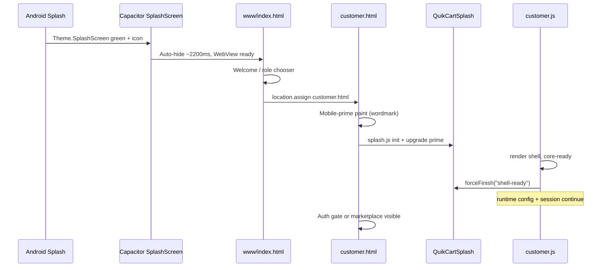

# QuikCart Splash / Startup Analysis

**Source studied (READ ONLY):** `D:\QQCART\QuikCart APP VND cursor`  
**Date:** 2026-07-24  
**Scope:** Splash screens, animations, startup flow, logo timing, theme, loading, branding, navigation  
**Constraint:** QuikCart and FixNow source were not modified; this file is an analysis deliverable only.

---

## Executive verdict

QuikCart uses a **three-layer splash stack**, not a single screen:

1. **Native Android / Capacitor SplashScreen** — green window + launcher icon (~2.2s auto-hide).
2. **Mobile shell welcome** (`Mobile-App/www/index.html`) — brand mark + wordmark + CTA (not the shared `#quikcartSplash`).
3. **Shared web splash** (`Frontend-shared/quikcart-splash.*`) — role HTML overlay with logo, wordmark, tagline, loader; hardened for mobile/Android freezes.

Startup is **brand-first, fail-safe heavy**. The splash is intentionally released as soon as the critical UI shell paints; optional APIs (runtime config, session restore, marketplace data) continue after dismiss. Mobile deliberately **skips leave animations** so GPU/blur stalls cannot pin the overlay.

---

## 1. How startup works

### 1.1 Native app cold start

```
Android process
  → Theme.SplashScreen (green #0d631b + ic_launcher_foreground)
  → Capacitor SplashScreen plugin (launchShowDuration: 2200ms, launchAutoHide: true)
  → WebView loads Mobile-App/www/index.html
  → Role welcome / role chooser
  → location.assign(role HTML)  e.g. /Frontend-customer/customer.html
  → Role page: mobile-prime splash → QuikCartSplash upgrade → shell ready → forceFinish
  → Auth gate or app shell
```

**Capacitor config** (`Mobile-App/capacitor.config.ts`):

| Setting | Value |
|--------|--------|
| `launchShowDuration` | `2200` |
| `launchAutoHide` | `true` |
| `backgroundColor` | `#0d631b` |
| `androidSplashResourceName` | `splash` |
| `androidScaleType` | `CENTER_CROP` |
| `showSpinner` | `false` |

Android theme (`res/values/styles.xml`, `values-v31/styles.xml`):

- Background: `@color/quikcart_splash_background` → `#0d631b`
- Animated icon: `@mipmap/ic_launcher_foreground`
- Window background: `@drawable/splash` (referenced; generated/synced via Capacitor assets — not checked into `res/` as a standalone named splash file in this tree)
- Status / nav bar colors aligned to brand greens

### 1.2 Mobile shell (before any role)

`Mobile-App/www/index.html` boots:

1. Native/API config, startup diagnostics, splash-tagline runtime, brand-mark, shell session.
2. Immediate welcome UI: produce mark + **Quik** / **Cart** + tagline (“Your Favourite Marketplace” by default).
3. `role-selector.js` `boot()` → `showShellImmediately()`:
   - Resume active role session if present → navigate straight into that role HTML.
   - Else restore pending “roles” screen, or show welcome.
4. Background: platform runtime + store-build guard (does not block first paint).

Welcome CTA → role cards → `location.assign` to:

| Role | Path |
|------|------|
| Customer | `/Frontend-customer/customer.html` |
| Vendor | `/Frontend-Vendor/vendor.html` |
| Shopper | `/Frontend-Shopper/shopper.html` |

Admin is **not** in the mobile role chooser; it is a separate web surface.

Before navigation, the shell **prefetches** role-specific APIs (`runtime-config`, categories, seed guides, etc.) so the next page warms caches.

### 1.3 Role HTML boot (shared web splash)

Each role page loads early:

- Appearance + i18n primes (customer especially)
- **Mobile prime** inline script (customer + vendor, `max-width: 720px`)
- Shared CSS/JS: `quikcart-splash.css` / `quikcart-splash.js` (cache-busted `v=2026-07-21-android-splash-repaint`)
- `splash-tagline-runtime.js` (hydrates CMS/runtime taglines)

**`QuikCartSplash` lifecycle:**

| Phase | Behavior |
|-------|----------|
| Auto-init | On script load / DOMContentLoaded: `init(roleFromBody)` |
| Boot lock | `html`/`body` get `quikcart-splash-boot` (+ mobile variants); all siblings of `#quikcartSplash` are `visibility: hidden` |
| Content | Brand mark SVG, wordmark, tagline, indeterminate loader bar + role loader label |
| Ready signal | Role JS calls `finish()` or `forceFinish(reason)` |
| Min dwell | Desktop ≥ **900ms**; mobile ≥ **1100ms** from splash JS start |
| Soft max | Desktop **2400ms**; mobile **5200ms** then `finish({ reason: "timeout" })` |
| Hard fail-safe | Desktop **3000ms**; mobile **5000ms** → `forceFinish("timeout")` |
| HTML fail-safe | Inline timer in role HTML mirrors hard limits and calls `forceFinish("html-failsafe")` |

Global flags used across races:

- `window.__quikcartSplashDismissed`
- Role-specific `window.__quikcartCustomerBootstrapDone` / `__quikcartVendorBootstrapDone`
- `window.__quikcartSplashDiag` (mobile diagnostics, especially ngrok / debug)

### 1.4 Per-role dismiss strategy

**Customer** (`customer.js`):

1. Critical path paints (`render()`, core-ready) → `finishCustomerBootstrapSplash("shell-ready")` **immediately**.
2. Parallel: `loadCustomerRuntimeConfig()`, `restoreCustomerSession()`, marketplace bootstrap.
3. Secondary finish: `Promise.race([runtime+session, splashBudget])` → `"runtime-session-ready"`.
   - Budget: **2500ms** normal, **4500ms** on Render API hosts.
4. Mobile always uses **`forceFinish`** (instant remove). Desktop uses animated `finish()`.

**Vendor:** Same pattern — `finishVendorBootstrapSplash("shell-ready")` right after shell paint; mobile `forceFinish`.

**Shopper:** `QuikCartSplash.finish()` after `restoreSession()` (or on fatal error). No mobile-prime block like customer/vendor.

**Admin:** `finish()` after seed status + session restore in `bootstrapAdminLoginSurface()` (or catch path).

### 1.5 Auth gate vs splash

Customer/vendor pages start `auth-locked`. Splash CSS keeps `#quikcartSplash` visible while hiding other body children. On mobile, `#authGate` is `display: none` during splash boot so the gate cannot flash under the splash. After dismiss, auth welcome shows with the same brand mark/wordmark language.

---

## 2. Assets used

### 2.1 Primary brand mark

| Asset | Path | Role |
|-------|------|------|
| Produce / nutrition leaf SVG | `/Frontend-shared/quikcart-brand-mark.svg` | Splash logo, headers, auth, AI chrome, mobile welcome |
| Brand mark CSS | `Frontend-shared/quikcart-brand-mark.css` | Sizing; kills legacy orange-dot `::after` overlays |
| Brand mark JS | `Frontend-shared/quikcart-brand-mark.js` | Upgrades legacy Material Symbol icons → SVG `` |

SVG fill: `#0d631b`. Geometry is flipped leaf-up at the source (`scale(1 -1)` transform comment in the SVG).

Preload pattern on role pages:

```html
<link rel="preload" as="image" href="/Frontend-shared/quikcart-brand-mark.svg">
```

Splash markup uses eager sync decode:

```html

```

### 2.2 Typography

| Use | Font |
|-----|------|
| Splash / shell wordmark | **Literata** (Google Fonts on web; local `@font-face` TTF in mobile shell) |
| UI body | Inter / system UI stacks |
| Legacy mobile-prime fallback | Georgia serif until shared CSS loads |

Wordmark split: **Quik** (cream on splash / green in chrome) + **Cart** (orange `#f59e0b`).

### 2.3 Native / store assets

- Android splash background color `#0d631b`
- Launcher foreground as Android 12+ splash animated icon
- Capacitor `androidSplashResourceName: "splash"` / `@drawable/splash` window background
- Play Console package copies under `project-docs/Play-Console/...` (icon master, feature graphic) — packaging, not runtime splash DOM
- Mobile shell also references local Literata font files under `/fonts/`

### 2.4 Runtime / CMS copy (not image assets)

Hydrated via `/api/runtime-config` → `splashTaglines` into `window.__QUIKCART_SPLASH_TAGLINES__`:

- Shared rotating taglines (default pool of 4)
- Per-role taglines + loader labels
- `androidWelcomeTagline` (shell welcome)
- `customerMobilePrimeTagline` (mobile-prime subtitle, default “Starting QuikCart…”)
- Fallback tagline

Backend: `Backend-Server/src/services/branding/splashTaglineSettings.js`.

### 2.5 What is *not* used

- No Lottie / Rive / video splash
- No animated GIF logo
- Material Symbols pineapple icons are **legacy**, actively replaced by the SVG mark
- Splash does not wait on AI script health or marketplace photo heroes

---

## 3. Animations & transitions

### 3.1 Shared splash CSS keyframes (`quikcart-splash.css`)

| Animation | Target | Intent |
|-----------|--------|--------|
| `qcSplashEnter` (760ms) | Shell stack | Fade up + scale in |
| `qcSplashLogo` (2.8s loop) | Logo tile | Subtle breathe (scale ~1 → 1.045) |
| `qcSplashPulse` (2.2s) | Logo halo | Soft glow pulse |
| `qcSplashLoad` (1.18s) | Loader bar | Indeterminate shimmer |
| `qcSplashAura` / `qcSplashWave` | Shell pseudo | Ambient aura + baseline wave |
| `qcSplashGradient` / `qcSplashGlow` | Full-bleed `::before`/`::after` | Slow rotating/blurred atmosphere |

Leave transition: opacity **420ms**; DOM remove after **460ms** (`is-leaving`).

### 3.2 Mobile hardening (critical)

At `max-width: 720px`:

- Background blur/glow **animations and filters disabled** (`animation: none`, `filter: none`) — Android WebView main-thread stalls were a known freeze cause.
- Leave animation **skipped**; `forceFinish` removes node immediately.
- Mobile-prime uses `opacity: 1 !important` while showing; leave rules must override with `!important` so dismiss cannot stick.

`prefers-reduced-motion: reduce` disables splash animations and shortens transitions to **120ms**.

### 3.3 Mobile-prime → full splash upgrade

Customer/vendor head scripts paint a **minimal** `#quikcartSplash.quikcart-splash--mobile-prime` (wordmark + “Starting QuikCart…”) before CSS/JS arrive.

When `quikcart-splash.js` runs, `upgradeMobilePrimeSplash()` strips the prime class and injects full markup (logo + loader). Tagline runtime can update the prime subtitle without forcing a full rebuild.

### 3.4 Desktop vs mobile finish

```
Desktop finish():
  wait remaining minimum dwell → clearSplash({ animate: true }) → fade out → remove

Mobile finish():
  wait remaining minimum dwell → forceFinish() → immediate remove, no leave animation
```

### 3.5 Shell navigation transitions

Role chooser welcome → roles is a **DOM swap** (innerHTML / className change), not a shared splash leave animation. Role open uses `location.assign` (full navigation). Prefetch reduces perceived blank time on the next splash.

Shell CSS defines welcome gradients and logo tile gradient; no dedicated CSS keyframe transition between welcome and role cards.

---

## 4. Logo timing

| Moment | What user sees | Timing control |
|--------|----------------|----------------|
| Native cold start | Green + launcher icon | Capacitor **2200ms** auto-hide |
| Shell welcome | SVG mark 88px + Literata wordmark | Immediate paint; no timed auto-advance |
| Role mobile-prime | Wordmark only (no logo yet) | As early as `<head>` / `DOMContentLoaded` |
| Role full splash | Cream tile + SVG mark + wordmark + loader | After splash JS upgrades / creates splash |
| Min brand dwell | Logo/splash remains | Mobile ≥ **1100ms**, desktop ≥ **900ms** from splash JS `startedAt` |
| Shell-ready dismiss | Customer/vendor may finish as soon as min dwell allows | Immediate `forceFinish` on mobile after shell paint |
| Fail-safe ceiling | Forced clear | Mobile **5s**, desktop **3s** (JS + HTML timers) |

Brand mark is treated as **critical paint**: preload + `decoding="sync"` + `loading="eager"`. Orientation/color are locked in the shared SVG so no “nutrition flash” or orange-dot pseudo overlay appears.

---

## 5. Theme & branding language

### 5.1 Splash palette (CSS variables)

```css
--qc-splash-green: #0d631b;
--qc-splash-green-bright: #27a844;
--qc-splash-orange: #f59e0b;
--qc-splash-orange-deep: #ff7a00;
--qc-splash-cream: #fff7e8;
--qc-splash-ink: #0f2416;
```

Background: multi-stop linear gradient green → orange, plus radial cream/orange accents.

Shared brand tokens (`quikcart-brand.css`): green `#0d631b`, orange `#f59e0b` for chrome wordmarks (Quik green / Cart orange — inverted from splash cream/orange because splash sits on green).

### 5.2 Shell welcome palette

Slightly brighter greens (`#126b28`, `#073719`, cream `#fffaf0`) with logo tile gradient green → orange. Same produce mark + Literata wordmark system.

### 5.3 Appearance preferences (post-splash)

`appearance-preferences-prime.js` sets `data-qcAppearanceBg` etc. **before** paint of the app chrome. Defaults are light role themes (`clean_white`, `business_light`, …). Splash itself is **not** appearance-themeable — it always uses the fixed green/orange brand splash.

Auth-locked bodies delay `qcAppearanceReady` until unlocked.

### 5.4 Branding composition (splash)

Centered vertical stack:

1. Logo tile (rounded square, cream fill, soft shadow)
2. Wordmark (Literata, Quik cream / Cart orange)
3. Tagline (cream, bold)
4. Loader track + uppercase role label

No cards, no promo chips, no secondary CTAs on the splash itself.

---

## 6. Loading model

Splash loading is **branding + readiness theater**, not a progress meter of real work:

- Indeterminate bar (`qcSplashLoad`) — visual only
- Role-specific label (“Customer marketplace”, “Vendor center”, …)
- Taglines may be random from shared pool unless role-specific CMS value set
- Real work continues **after** splash on customer/vendor (runtime config, session, shops)
- Connection failure surfaces as an auth-gate notice (“Connecting…” / Retry), not by re-showing splash

Hard guarantees:

- Page content cannot stay permanently hidden behind `quikcart-splash-boot` if timers fire
- Android freeze path: skip blur animations + skip leave opacity + recover stuck finish via `forceFinish`
- Tests: `androidSplashFreeze.test.js`, `customerMobileAuthSplash.test.js`, `vendorStartupPerformance.test.js`, `splashTaglineSettings.test.js`

---

## 7. Navigation after splash

### Mobile

```
index.html welcome
  → role chooser
    → customer.html | vendor.html | shopper.html
      → splash dismiss
        → auth gate (if locked) OR app shell
```

Session resume can skip welcome and jump to the last active role.

### Web (role URL direct)

Hit role HTML → splash → auth or app. Admin similarly.

### Auth relationship

- Splash and auth gate can coexist in DOM; splash boot hides gate until clear.
- After dismiss, `auth-locked` still hides app chrome until login/guest.
- Brand continuity: auth logo uses the same SVG + Quik/Cart wordmark.

---

## 8. Architecture map (key files)

| Layer | Files |
|-------|--------|
| Shared splash engine | `Frontend-shared/quikcart-splash.js`, `quikcart-splash.css` |
| Tagline hydration | `Frontend-shared/splash-tagline-runtime.js` |
| Brand mark | `quikcart-brand-mark.svg/.js/.css`, `quikcart-brand.css` |
| Tagline CMS | `Backend-Server/src/services/branding/splashTaglineSettings.js` |
| Customer/vendor mobile prime | Inline `<head>` in `customer.html`, `vendor.html` |
| Role dismiss | `customer.js`, `vendor.js`, `shopper.js`, `admin.js` |
| Mobile shell | `Mobile-App/www/index.html`, `role-selector.js`, `role-selector.css` |
| Native splash | `Mobile-App/capacitor.config.ts`, Android `styles.xml`, `colors.xml` |
| Diagnostics | `mobile-startup-diagnostics.js`, `web-startup-diagnostics.js`, `__quikcartSplashDiag` |

---

## 9. Sequence diagram (customer mobile)



---

## 10. Design principles extracted (for reuse)

1. **Layered handoff:** Native color/icon → shell brand → web splash → product UI, same green `#0d631b` and orange accent throughout.
2. **Prime paint before CSS:** Minimal inline splash prevents white flash on slow mobile networks.
3. **Shell-ready, not data-ready:** Dismiss when chrome can paint; hydrate APIs after.
4. **Fail-safes at every layer:** Splash JS max, hard force, HTML timer, finish-recover if classes stick.
5. **Mobile prefers static paint over motion:** Kill blur/animation on small viewports; never leave-animate on Android.
6. **One brand mark asset:** SVG produce leaf, eager/preload, no icon-font flash.
7. **CMS copy, fixed visuals:** Taglines/labels remote; colors/logo/layout local and stable.
8. **Auth continuity:** Splash branding matches auth gate branding so dismiss feels like reveal, not theme change.

---

## 11. Gaps / notes observed

- `@drawable/splash` is referenced by Android styles and Capacitor config; a dedicated splash drawable file was not present under `res/` in this workspace snapshot (likely Capacitor asset sync / build output).
- Mobile shell CSS still defines `.quikcart-shell-splash` styles, but current `index.html` shows the welcome screen directly (shell splash node path appears legacy / unused in the live HTML).
- Shopper/admin lack the customer/vendor mobile-prime hardening path.
- Splash duration constants differ slightly between shared splash JS (min/max/hard) and customer bootstrap race budget (2500/4500) — intentional layered budgets, not a single clock.

---

*End of analysis. QuikCart source was inspected read-only; FixNow app code was not modified.*
