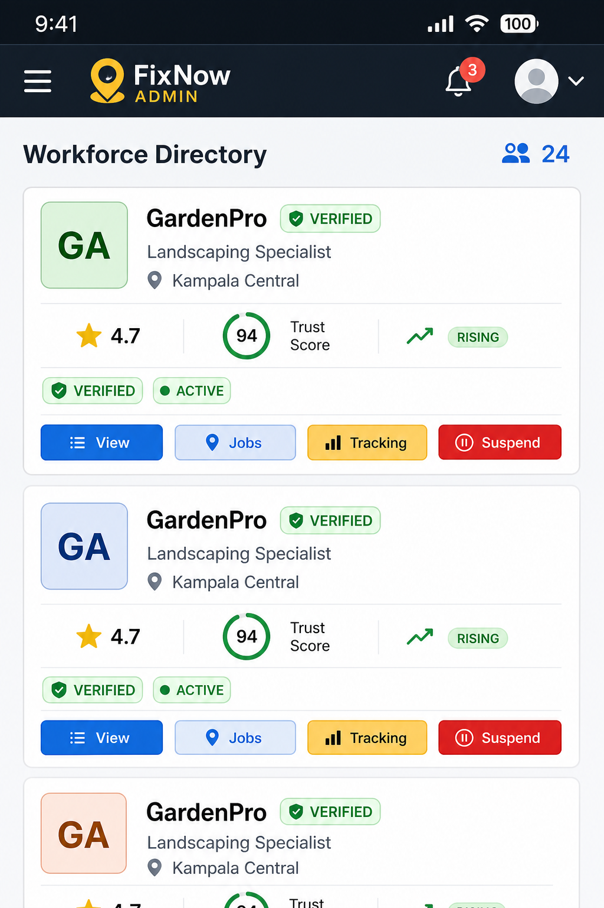
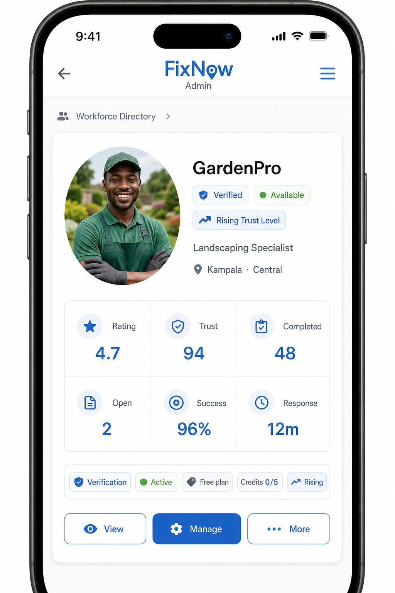
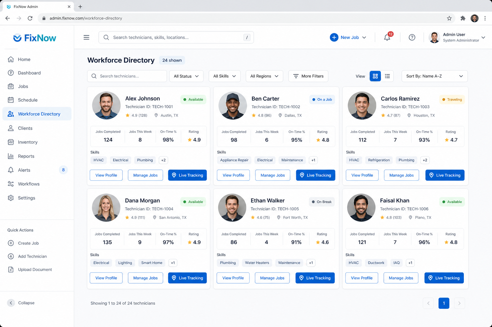

# Workforce Directory UX Redesign

Professional technician cards for the FixNow Admin Portal — Desktop · Tablet · Mobile Web · Android Capacitor · iOS.

**Status:** Implemented  
**Date:** 28 Jul 2026  
**Surfaces:** `TechniciansPage` + `apps/admin/components/technicians/*`

---

## Verdict

The Workforce Directory no longer uses cramped list rows with four always-visible action buttons. It is now a **responsive card grid** with a clear four-row hierarchy, a consolidated **More Actions** menu, real backend KPIs, pagination, lazy Cloudinary avatars, and memoized cards.

---

## Before vs After

### Before (mobile)



Problems addressed:

- Duplicate **Verified** badges
- Four squeezed action buttons (`View` / `Jobs` / `Tracking` / `Suspend`)
- Small square initials avatar
- Trust, rating, and credits visually disconnected
- Tall cards → few technicians per viewport

### After (mobile)



- Large circular profile photo (Cloudinary when available)
- Identity row: name · verification · availability · trust level · category · location
- Compact KPI strip (Rating / Trust / Completed / Open / Success / Response)
- Admin chips (verification, account, subscription, credits, priority)
- Primary actions: **View · Manage · More** (44px touch targets)

### After (desktop)



- Responsive grid: 1 → 2 → 3 → 4 columns
- Primary actions: **View Profile · Manage Jobs · Live Tracking**
- Overflow menu in the card header (desktop/tablet)

---

## New card hierarchy

```
┌─────────────────────────────────────────────────────────┐
│ ROW 1 — Identity                                        │
│  ○ Large circular photo                                 │
│  Name · Verified · Available · Trust Level              │
│  Service category                                       │
│  Location (District · Parish)                           │
├─────────────────────────────────────────────────────────┤
│ ROW 2 — Professional KPI strip                          │
│  ★ Rating │ Trust │ Completed │ Open │ Success │ Resp. │
├─────────────────────────────────────────────────────────┤
│ ROW 3 — Administrative status chips                     │
│  Verification · Account · Subscription · Credits · Tier │
├─────────────────────────────────────────────────────────┤
│ ROW 4 — Primary actions                                 │
│  View Profile · Manage Jobs · Live Tracking · More      │
│  (Mobile: View · Manage · More)                         │
└─────────────────────────────────────────────────────────┘
```

---

## Component structure

```
apps/admin/
  pages/TechniciansPage.tsx          # Orchestration, filters, pagination, detail drawer
  components/technicians/
    TechnicianCard.tsx               # Memoized 4-row card
    TechnicianDirectory.tsx          # Responsive grid + content-visibility
    TechnicianActionsMenu.tsx        # Overflow menu wrapper
    technicianMenu.ts                # Action catalogue
    technicianHelpers.ts             # Labels, tones, formatters
```

Shared primitives reused: `ProfileAvatar`, `StatusBadge`, `LevelBadge`, `OverflowMenu`, `Button`, `Dialog`.

---

## Responsive behaviour

| Breakpoint | Layout | Primary actions |
|---|---|---|
| Mobile (&lt;640px) | 1-column stack | View · Manage · More |
| Tablet (sm+) | 2-column grid | View Profile · Manage Jobs · Live Tracking + header More |
| Desktop (xl+) | 3-column grid | Same as tablet |
| Wide (2xl+) | 4-column grid | Same as tablet |
| Android / iOS Capacitor | Same web layout in WebView | 44px+ targets, no horizontal scroll |

No clipped buttons. No horizontal scrolling inside cards.

---

## More Actions menu

Keeps destructive / infrequent operations out of the permanent chrome:

| Section | Actions |
|---|---|
| Navigate | View profile, Manage jobs, Live tracking |
| Account access | Activate, Suspend, Disable |
| Compliance | Verify, Assign admin note, Trust Centre, View audit |
| Operations | Reset password, Send notification, Export |
| Danger zone | Delete (when permitted) |

Wired to real admin APIs where available (`suspend`, `unlock`, `lock`, `updateTechnician`, `resetPassword`); navigation for audit / notifications / trust; client JSON export for Export.

---

## Real data only

Every card value comes from the backend (no placeholders / fake ratings).

| UI field | Source |
|---|---|
| Photo | `profile.photoUrl` → Cloudinary / media URL |
| Name | `user.fullName` |
| Verification | `profile.verificationStatus` |
| Availability | `profile.isAvailableNow` |
| Trust level | `profile.currentRank` → reputation level |
| Category | Category lookup via `primaryCategoryId` (fallback: headline) |
| Location | `profile.location.district` / `parish` |
| Rating | `profile.ratingAverage` |
| Trust score | `profile.trustScore` |
| Completed jobs | `profile.jobsCompleted` |
| Open jobs | Aggregated `Job` count (assigned / en route / in progress / awaiting confirmation) |
| Success rate | `jobsCompleted / (completed + cancelled)` |
| Response time | `profile.responseTimeMinutesAvg` (shows — when null) |
| Subscription | `profile.subscriptionPlanCode` (Free plan when empty) |
| Job credits | `remainingFreeJobs` / `freeJobLimit` |
| Account status | lock / suspend / unlock-requested derived status |

Backend enrichment lives in `admin.service.ts` → `listTechnicians`.

---

## Accessibility improvements

- Card open controls and overflow menus are keyboard reachable
- Overflow menu: arrow keys, Home/End, Escape, focus restore
- `aria-label` on directory, KPI group, admin status, photo buttons, menus
- Status chips use high-contrast tone tokens from the admin design system
- Touch targets ≥ 44px (`min-h-11`) on filters and actions
- Screen-reader friendly verification / availability / lock labels

---

## Performance improvements

| Technique | Implementation |
|---|---|
| Pagination | Server `page` + `limit` (24 per page), Previous / Next controls |
| Lazy images | `ProfileAvatar` → `LazyImage` (`loading="lazy"`) |
| Cloudinary | `cloudinaryPresetUrl(..., 'avatar2x')` for circular avatars |
| Memoization | `React.memo` on `TechnicianCard` and `TechnicianDirectory` |
| Content visibility | `content-visibility: auto` + `contain-intrinsic-size` on cards |
| Realtime refresh | Existing socket events still reload the directory |

---

## Profile photos

1. Prefer Cloudinary / media `profileImageUrl` / `photoUrl`
2. Initials disc **only** when no photo exists or load fails
3. Circular crop + soft shadow
4. Online dot from `isAvailableNow`
5. Verified mark on the avatar when verified

---

## Visual system

- Soft cards, 16–20px radius, light layered shadow
- Spacing over heavy borders between sections
- Consistent 11px uppercase chip sizing (`StatusBadge` / `LevelBadge`)
- KPI cells share one quiet strip treatment (no competing gauges)
- FixNow primary / secondary tokens retained (no purple redesign)

---

## Files changed

| Area | Files |
|---|---|
| Backend | `backend/src/services/marketplace/admin.service.ts` |
| Types | `packages/types/admin.ts` |
| Mapper | `packages/api/mappers.ts` |
| UI primitives | `apps/admin/components/ui.tsx` (`OverflowMenu` trigger label) |
| Page | `apps/admin/pages/TechniciansPage.tsx` |
| New components | `apps/admin/components/technicians/*` |
| Docs | `WORKFORCE_DIRECTORY_UX_REDESIGN.md`, `docs/workforce-directory/*` |

---

## Test checklist

- [ ] Desktop (≥1280px): 3–4 cards per row, aligned KPI strips
- [ ] Tablet: 2-column grid, no clipped actions
- [ ] Mobile web: View / Manage / More only; 44px targets
- [ ] Android Capacitor WebView: scroll + tap targets
- [ ] iOS Safari / Capacitor: circular photos, no overflow
- [ ] Missing photo → initials fallback
- [ ] Cloudinary photo → circular image (no initials overlay when photo loads)
- [ ] Suspend / Activate / Disable / Verify hit live APIs
- [ ] Pagination Previous / Next with URL `page` param
- [ ] Keyboard: open card, open More menu, Escape closes menu
- [ ] Screen reader announces technician name and action menus

---

## Comparable systems

The layout targets the scan patterns of Salesforce Field Service, Dynamics 365 Field Service, and ServiceNow workforce lists — identity first, dense KPI strip second, admin metadata third, primary actions last — while keeping FixNow colour, type, and badge language.
