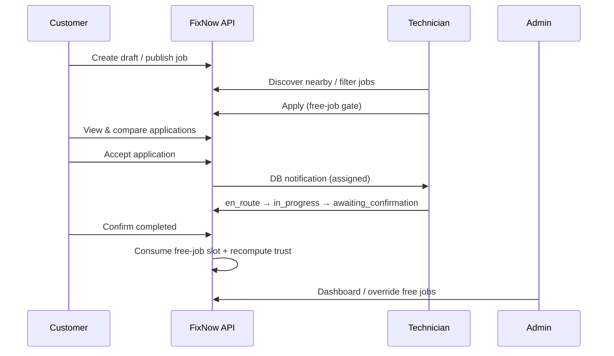

# FixNow Marketplace Engine

Complete job marketplace workflow connecting Customer → Job → Applications → Assignment → Completion, with Admin monitoring, free-job limits, and trust updates.

---

## 1. Workflow



---

## 2. Job status transitions

```
draft → posted | cancelled | archived
posted → assigned | cancelled | archived
assigned → technician_en_route | cancelled | disputed
technician_en_route → in_progress | cancelled | disputed
in_progress → awaiting_confirmation | disputed | cancelled
awaiting_confirmation → completed | in_progress | disputed
completed → archived
cancelled → archived
disputed → in_progress | cancelled | completed | archived
archived → (terminal)
```

Illegal transitions return `400 BAD_REQUEST`. Every legal change appends to `statusHistory` and `timeline`.

Implemented in `src/utils/jobTransitions.ts` + `jobMarketplaceService.transitionStatus`.

---

## 3. Free-job limit algorithm

Config key: `marketplace.free_jobs` (`PlatformSetting`)

```
{ enabled: true, defaultLimit: 20, lockAfterLimit: true }
```

On technician profile create:
- `freeJobLimit = defaultLimit`
- `remainingFreeJobs = defaultLimit`
- `freeJobsUsed = 0`

On **job completed** (assigned technician):
1. `freeJobsUsed += 1`
2. `jobsCompleted += 1`
3. `remainingFreeJobs = max(0, freeJobLimit - freeJobsUsed)`
4. If `lockAfterLimit && remainingFreeJobs <= 0`:
   - `accountLocked = true`
   - `lockReason = "Free job limit reached"`
   - `accountStatus = locked`

While locked / remaining ≤ 0:
- May browse jobs and receive DB notifications
- **Cannot apply** (`assertCanApplyToJobs`)
- **Cannot see customer contact** details on assigned jobs
- **Cannot accept new assignments** (accept path re-checks gate)

Admin override (`POST /admin/technicians/:id/free-jobs`):
- Set `freeJobLimit` / `remainingFreeJobs`
- `unlock: true` clears lock and restores active status
- Immediately allows apply again

---

## 4. Trust update algorithm (v1)

Triggered after successful business events (job completed, admin recompute):

```
completionRate = completed / (completed + cancelled)   // 50 if none
reliability    = clamp(completionRate)
completion     = clamp(40 + min(completed,40) + completionRate*0.2)
response       = clamp(existing or 60 + min(completed,20))
punctuality    = clamp(existing or 60 + min(completed,25))
trust          = 0.35*reliability + 0.30*completion + 0.20*response + 0.15*punctuality
```

Persisted to `TrustScore` and denormalized onto `TechnicianProfile`. Rank/experience derived from trust/years. Milestone badges attached when present in `Badge` collection.

Applying to a job bumps `responseScore` slightly.

---

## 5. API list (marketplace)

### Customer
| Method | Path |
|--------|------|
| GET/PATCH | `/customers/me` |
| GET/POST/PATCH/DELETE | `/customers/me/addresses` |
| GET/POST/DELETE | `/customers/me/saved-technicians` |
| GET | `/customers/me/jobs` |

### Technician
| Method | Path |
|--------|------|
| GET/PATCH | `/technicians/me/profile` |
| PATCH | `/technicians/me/availability` |
| PUT | `/technicians/me/working-hours` |
| GET/POST/DELETE | `/technicians/me/coverage` |
| POST | `/technicians/me/services` |
| GET | `/technicians/me/dashboard` |
| GET | `/technicians/search` |
| GET | `/technicians/:id` |

### Jobs & applications
| Method | Path |
|--------|------|
| POST | `/jobs` (`publish?: boolean`) |
| GET | `/jobs`, `/jobs/nearby` |
| GET/PATCH | `/jobs/:id` |
| PATCH | `/jobs/:id/status` |
| POST | `/jobs/:id/publish`, `/cancel`, `/archive` |
| POST/GET | `/jobs/:id/applications` |
| GET | `/applications/me` |
| POST | `/applications/:id/accept\|reject\|withdraw` |

### Categories
| Method | Path |
|--------|------|
| GET | `/categories` (search/filter) |
| POST/PATCH | `/categories`, `/categories/:id` |
| POST/PATCH | `/categories/subcategories` |

### Admin
| Method | Path |
|--------|------|
| GET | `/admin/dashboard`, `/admin/marketplace/metrics` |
| GET | `/admin/customers/:id`, `/admin/technicians`, `/admin/jobs`, `/admin/applications` |
| PATCH | `/admin/technicians/:id` |
| POST | `/admin/technicians/:id/suspend\|unlock\|free-jobs` |
| PUT | `/admin/settings/free-jobs` |

All require auth + role where noted; Zod validation on mutating bodies; pagination via `?page&limit&sort&q`.

---

## 6. Business rules summary

1. Only **posted** jobs accept applications.
2. One active application per technician per job (withdrawn can re-apply).
3. Accepting an application assigns the technician, rejects other pending apps, creates `Assignment`, notifies technician (DB).
4. Status changes are role-gated (customer confirms completion; technician advances en_route/in_progress/awaiting).
5. Free-job lock is marketplace-level, separate from auth login lock (though statuses align).
6. Audit logs written for create/publish/apply/accept/status/admin overrides.

---

## 7. Key files

```
src/services/marketplace/
  customer.service.ts
  technician.service.ts
  category.service.ts
  job.service.ts
  freeJob.service.ts
  trust.service.ts
  admin.service.ts
src/utils/jobTransitions.ts
src/utils/pagination.ts
src/utils/notify.ts
```

---

## 8. Notifications

`createDbNotification` writes `Notification` documents only — **no push, SMS, or email** in this engine.
